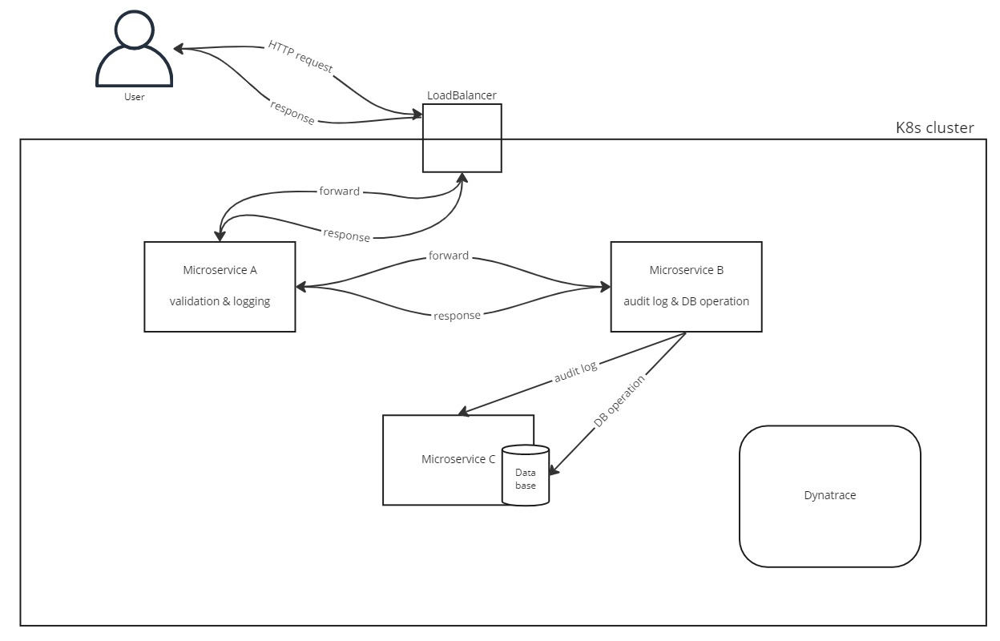

# Project Proposal

## General Idea
The idea of this project is to set up a kubernetes cluster and observe the cluster with Dynatrace. The kubernetes cluster runs one node and multiple pods and is hosted on Google Kubernetes Engine (GKE). Several microservices - communicating between each other - are running on the K8s cluster. Dynatrace is used to monitor traces between microservices, logs, metrics and the health of the K8s cluster.

### Focus
As our topic allows for various different points of focus, we explicitly outline what we will focus during our presentation:
- Communication between the microservices
  - Dynatrace PurePaths
- Logs the microservices produce

### Installation of Dynatrace OneAgent in GKE
We will setup Dynatrace OneAgent according to the following guide (provided by Dynatrace): [Setup Dynatrace in GKE](https://learn.dynatracelabs.com/workshops/kubernetes-gke/index.html#0)

In short, this requires the following steps:
- Set up a GKE cluster
- Get a free trial of Dynatrace
- Create a dedicated VM for the Dynatrace ActiveGate
- Install the Dynatrace OneAgent Operator for Kubernetes
- Verify everything works

## Components
The project consists of 3 microservices communicating with each other in terms of forwarding a HTTP request and performing different actions related to the request. These microservices will run on Kubernetes pods and will be monitored by Dyntrace.

Example:
- User sends HTTP request
- Microservice A handles request, performs basic validation and logs the HTTP body message
- Microservice A forwards the request to Microservice B
- Microservice B stores request audits in a database hosted on Microservice C
- Microservice B forwards database storage result to Microservice A
- Microservice A logs whether the data storage process was successful or not

A high level architecture can be seen below:

## Milestones
- Microservices are implemented
- Cluster running on Google Kubernetes Engine is setup
- Microservices are configured on K8s cluster
- Dynatrace is installed
- Data provided by Dynatrace is analyzed
- Loadtest (e.g., k6) to simulate many users and generate data has been created

## Responsibilities
- Jakob Rumpelsberger
  - Configure Microservices A, B and C
  - Install Dynatrace
- Lukas Weidinger
  - Implement microservice A
  - Setup K8s cluster
  - Loadtest
- Fabian Weißenböck
  - Implement Microservice B
  - Implement Microservice C
- All of us
  - Analyze data provided by Dynatrace

#### Maintainers
- Jakob Rumpelsberger
- Lukas Weidinger
- Fabian Weißenböck
