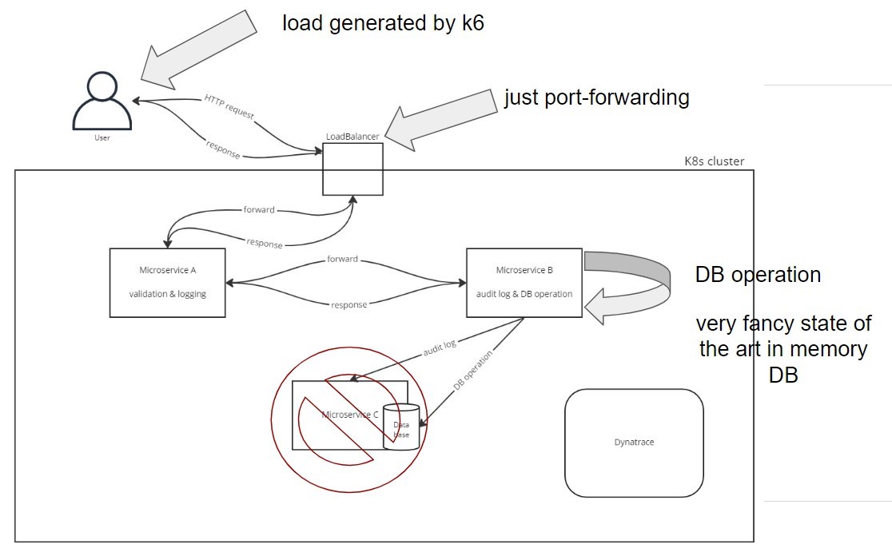

# Documentation #
This project is about setting up a kubernetes cluster and observe the cluster with Dynatrace.
The kubernetes cluster runs one node and multiple pods and is hosted on Google Kubernetes Engine (GKE).
Two microservices - communicating between each other - are running on the K8s cluster.
Dynatrace is used to monitor traces between microservices, logs, metrics and the health of the K8s cluster.

## Structure ##
The project consists of two different microservices (microservice-a and microservice-b) and a load test.
A helper project called shared serves as the purpose of defining a global communication standard.
In detail, the request and response classes for communication via REST across Microservice A and B are defined.
To generate load in order to observe data with Dynatrace a load test is implemented using k6.

## Technologies ##
1. Java
2. Maven
3. Quarkus
4. K6
5. Docker
6. Kubernetes
7. Git
8. Dynatrace

### System Architecture ###

 
## Prerequisites ##

1. Account in [Google Cloud](http://cloud.google.com/)

2. Install the [Google Cloud SDK](https://cloud.google.com/sdk/install). After installing the Google Cloud SDK, you have the command-line tool *gcloud* available in your terminal.

   Run the command:
    ```console
    gcloud version
    ```

3. Run the `kubectl` installation command:

   ```console
   gcloud components install kubectl

4. GKE Cluster up and running. Follow the steps as described in [GKE cluster setup](https://github.com/clc3-CloudComputing/ws22/tree/main/3%20Kubernetes/exercise%203.1)

5. JDK 11+ installed with JAVA_HOME configured appropriately

6. Apache Maven

7. Docker Deamon

8. Pull this repository

9. Dynatrace SaaS/Managed Account. Get your free SaaS trial [here](https://www.dynatrace.com/trial/).

## Setup ##

### Microservice A ###

1. Switch to microservice-a directory

2. Set property `quarkus.container-image.group` in file `application.properties` to the Docker Hub username

3. Run the `mvn install` command

4. Run the `mvn compile quarkus:dev` command

5. Test connection using the following command:
   ```console
   curl http://localhost:8080/api/healthcheck
   ```
   Output:
   ```console
   Microservice A available
   ```

6. Use the `mvn package -DskipTests` to build the application. It will generate a single JAR that contains all the classes of your application including its dependencies.

7. Build the docker image with the following command:
   ```console
      docker build -f src/main/docker/Dockerfile.jvm -t <hub-user>/microservice-a:1.0.0 .
   ```
8. Run `docker images|grep <hub-user>`

   ```console
      <hub-user>/microservice-a               1.0.0     e3a2dc357a42   7 min ago     422MB  422MB
   ```

9. Login to Docker Hub with `docker login`

10. Push Docker container image to Docker Hub:
    ```console
       docker push <hub-user>/microservice-a:1.0.0
    ```

11. Apply the deployment to your Kubernetes cluster using:
    ```console
       kubectl apply -f target/kubernetes/kubernetes.yml
    ```
   
12. You can see all your active pods by executing `kubectl get pods`

    ```console
       NAME                              READY   STATUS    RESTARTS   AGE
       microservice-a-7c788bbf6c-6hv6d   1/1     Running   0          13s
    ```

13. Use port-forwarding to access the service:

   ```console
       kubectl port-forward service/microservice-a 8080:http
    ```
   
14. Test connection:

   ```console
      curl http://localhost:8080/api/healthcheck
   ```
    Output:
    ```console
      Microservice A available
    ```


### Microservice B ###

1. Switch to microservice-b directory

2. Set property `quarkus.container-image.group` in file `application.properties` to the Docker Hub username

3. Run the `mvn install` command

4. Run the `mvn compile quarkus:dev` command

5. Test connection using the following command:
   ```console
      curl http://localhost:8081/api/healthcheck
   ```
   Output:
   ```console
      Microservice A available
   ```

6. Use the `mvn package -DskipTests` to build the application. It will generate a single JAR that contains all the classes of your application including its dependencies.

7. Build the docker image with the following command:
   ```console
      docker build -f src/main/docker/Dockerfile.jvm -t <hub-user>/microservice-b:1.0.0 .
   ```
8. Run `docker images|grep <hub-user>`

   ```console
      <hub-user>/microservice-a               1.0.0     e3a2dc357a42   7 min ago     422MB  422MB
      <hub-user>/microservice-b               1.0.0     fc67d184a8f2   8 seconds ago   410MB

   ```

9. Login to Docker Hub with `docker login`

10. Push Docker container image to Docker Hub:
    ```console
       docker push <hub-user>/microservice-a:1.0.0
    ```

11. Apply the deployment to your Kubernetes cluster using:
    ```console
       kubectl apply -f target/kubernetes/kubernetes.yml
    ```

12. You can see all your active pods by executing `kubectl get pods`

    ```console
       NAME                              READY   STATUS    RESTARTS   AGE
       microservice-a-89b964bc-plb2j     1/1     Running       0          3h22m
       microservice-b-84dd55d6b8-vcn7f   1/1     Running       0          4s
    ```

13. Use port-forwarding to access the service:

```console
    kubectl port-forward service/microservice-b 8081:http
 ```

14. Test connection:

```console
   curl http://localhost:8081/api/healthcheck
```
   Output:
```console
   Microservice B available
```

### Setup Dynatrace Monitoring ###

1. In the Dynatrace application navigate to Deploy Dynatrace → Install OneAgent → Kubernetes / OpenShift and follow the described steps


### Loadtests ###
Used to simulate load on the k8s cluster to create traces, logs and more, which can be visualized using Dynatrace.

1. Install `k6`: See [https://k6.io/docs/get-started/installation/](here)

2. Run `k6` (assuming having installed `k6` docker): `docker run --rm -i grafana/k6 run - < some-file.js`

### Observe Data in Dynatrace ###

1. Observe k8s workloads (deployments, services, pods). See [https://www.dynatrace.com/support/help/how-to-use-dynatrace/infrastructure-monitoring/container-platform-monitoring/kubernetes-monitoring](Dynatrace Kubernetes monitoring)

2. View logs of the deployed microservices. See [https://www.dynatrace.com/support/help/how-to-use-dynatrace/log-monitoring/analyze-log-data/log-viewer](Dynatrace log monitoring)

3. Take a look at the distributed traces. See [https://www.dynatrace.com/support/help/how-to-use-dynatrace/diagnostics/diagnostic-distributed-traces](Dynatrace distributed traces)

4. Observe metrics created by Dynatrace. See [https://www.dynatrace.com/support/help/how-to-use-dynatrace/metrics](Dynatrace metrics)

## Lessons learned ##
1. Setup of k8s cluster on GKE

2. Creating microservices with Java Quarkus

3. Instrumentation with Dynatrace on k8s cluster

4. Dynatrace uses a lot of resources

5. Learned how to generate k8s configurations (yml files) using the Quarkus framework

6. Quite difficult to get a MySQL service properly running in k8s

7. Difficulties when combining different technologies
   - Spring and Quarkus
   - MySQL, H2 on k8s